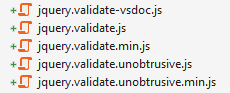

<!-- section start -->
<!-- attr: { id:'', class:'slide-title', showInPresentation:'True', hasScriptWrapper:'True', style:'' } -->
# AJAX with ASP.NET MVC


<div style="font-size: 24px; position: relative; top: 45%; left: 5%">
    <p>*ASP.NET MVC*</p>
    <p>Telerik Software Academy</p>
    <a href="http://academy.telerik.com">http://academy.telerik.com</a>
</div>

<!-- section start -->
<!-- attr: { id:'', class:'', showInPresentation:'True', hasScriptWrapper:'True', style:'' } -->
# Table of Contents
- What is AJAX?
  - Raw AJAX vs. using library
- Unobtrusive JavaScript
  - Unobtrusive Validation
  - Unobtrusive AJAX
- AJAX MVC Helpers
  - ActionLink
  - BeginForm
  - Partial views and AJAX
- JSON, AJAX and ASP.NET MVC


<!-- section start -->
<!-- attr: { id:'', class:'slide-section', showInPresentation:'True', hasScriptWrapper:'True', style:'' } -->
# What is AJAX?


<!-- attr: { id:'', class:'', showInPresentation:'True', hasScriptWrapper:'False', style:'font-size: 42px' } -->
# AJAX
- AJAX is acronym of `Asynchronous JavaScript and XML`
  - Technique for asynchronously (in the background) loading of dynamic content and data from the server side
  - Allows dynamic client-side changes
- Two styles of AJAX
  - Partial page rendering – loading of HTML fragment and showing it in a `<div>`
  - JSON service – loading JSON object and client-side processing it with JavaScript / jQuery


<!-- attr: { id:'', class:'', showInPresentation:'True', hasScriptWrapper:'False', style:'font-size: 42px' } -->
# AJAX Pros and Cons
- Advantages
  - Asynchronous calls
  - Minimal data transfer (traffic)
  - Limited processing on the server
  - Responsiveness
- Disadvantages
  - The back and refresh button are useless
  - Depends on javascript

<!-- attr: { id:'', class:'', showInPresentation:'True', hasScriptWrapper:'False', style:'' } -->
# The XMLHttpRequest object
- Raw AJAX
- Used to send HTTP or HTTPS requests directly to a web server
- The data might be received from the server as JSON, XML, HTML, or as plain text.
- Requests will only succeed if they are made to the same server that served the original web page


<!-- attr: { id:'', class:'', showInPresentation:'True', hasScriptWrapper:'False', style:'font-size: 42px' } -->
# Demo: Raw AJAX

- Raw AJAX _Example_

```javascript
function getServerTime() {
	 var xhr = new XMLHttpRequest();
	 xhr.open("GET", "/Home/ServerTime", true);
	 xhr.onreadystatechange = function() {
      if(xhr.readyState == 4) {
         if(xhr.status == "200") {
            var timeDiv=  
            document.getElementById("timeDisplay");
            timeDiv.innerHTML= xhr.responseText;
         } else {
            alert('Status not OK: '+xhr.status);
         }
      }
   }
   xhr.send();
}
```

<!-- attr: { id:'', class:'', showInPresentation:'True', hasScriptWrapper:'true', style:'font-size: 42px' } -->
# Demo: AJAX with jQuery
- AJAX with jQuery example:

```html
<div id="timeDisplay"></div>
<a onclick="getServerTime()">Get server time</a>
```

```javascript
function getServerTime() {
    $("#timeDisplay").load("/Home/ServerTime");
}
```
- You can use also jQuery functions like:
  - .ajax()
  - .get()
  - .post()

<!-- section start -->
<!-- attr: { id:'', class:'slide-section', showInPresentation:'True', hasScriptWrapper:'True', style:'' } -->
# Unobtrusive JavaScript

<!-- attr: { id:'', class:'', showInPresentation:'True', hasScriptWrapper:'True', style:'' } -->
# Unobtrusive Javascript
- Key points:
  - Pros:
    - avoidance of inline javascript - cleaner HTML
    - separation of concerns
    - modularity
    - graceful page degradation - better accessibility
  - Cons:
    - potentially lower discoverability
    - less straighforward
  - [**read more**](https://en.wikipedia.org/wiki/Unobtrusive_JavaScript)

<!-- attr: { id:'', class:'', showInPresentation:'True', hasScriptWrapper:'True', style:'font-size: 42px' } -->
# Obtrusive vs. Unobtrusive Javascript
- Obtrusive:
    + inline scripting

```html
<button onclick="alert('Click!');">Click me!</button>
```
- Unobtrusive:
    + attach attributes and use them as **hooks**

```html
<button id="alert-btn">Click me!</button>
```
```javascript
document.getElementById('alert-btn').onclick = 
function () {
    alert('Click!');
};
```

<!-- attr: { id:'', class:'', showInPresentation:'True', hasScriptWrapper:'True', style:'font-size: 42px' } -->
# Unobtrusive Validation
- AngularJS markup:

```angular
<input type="text" name="lastName" ng-model="user.last"
       ng-minlength="3" ng-maxlength="10">
```
- MVC generated markup:

```html
<input id="FirstName" data-val="true" 
       data-val-required="Please enter the first name." 
       name="FirstName" type="text" 
       value="">
<span class="field-validation-valid" 
      data-valmsg-for="FirstName" 
      data-valmsg-replace="true">
</span>
```

<!-- attr: { id:'', class:'', showInPresentation:'True', hasScriptWrapper:'True', style:'font-size: 42px' } -->
# Unobtrusive Validation with ASP.NET MVC
- View models with data annotations:

```cs
public class BookViewModel
{
    [Display(Name = "Book title")]
    [Required]
    [MaxLength(20)]
    public string Title { get; set; }

    [Range(1, 50)]
    public decimal Price { get; set; }

    [Display(Name = "Author name")]
    [RegularExpression("[a-z|A-Z]+")]
    public string Author { get; set; }
}
```

<!-- attr: { id:'', class:'', showInPresentation:'True', hasScriptWrapper:'True', style:'font-size: 42px' } -->
# Unobtrusive Validation with ASP.NET MVC
- Sample Razor code:

```cs
@model UnobtrusiveJSDemos.Models.BookViewModel
@using (Html.BeginForm())
{
    @Html.TextBoxFor(x => x.Title)
    @Html.ValidationMessageFor(x => x.Title)

    @Html.TextBoxFor(x => x.Price)
    @Html.ValidationMessageFor(x => x.Price)

    @Html.TextBoxFor(x => x.Author)
    @Html.ValidationMessageFor(x => x.Author)

    <input type="submit" class="form-control" value="Submit" />
}
```

<!-- attr: { id:'', class:'', showInPresentation:'True', hasScriptWrapper:'True', style:'font-size: 42px' } -->
# Unobtrusive Validation with ASP.NET MVC
- In the action:

```cs
[HttpPost]
public ActionResult NewBook(BookViewModel book)
{
    if (!ModelState.IsValid)
    {
        // handle validation errors
    }

    // handle valid data
}
```

<!-- attr: { id:'', class:'', showInPresentation:'True', hasScriptWrapper:'True', style:'font-size: 42px' } -->
# Unobtrusive Validation with ASP.NET MVC
- For client-side validations:
  - the templated jquery scripts are needed
  - register the validation bundle:
  

  
```cs
public static void RegisterBundles(BundleCollection bundles)  
{
    bundles.Add(new ScriptBundle("~/bundles/jquery")
        .Include("~/Scripts/jquery-{version}.js"));
        
    bundles.Add(new ScriptBundle("~/bundles/jqueryval")
        .Include("~/Scripts/jquery.validate*"));
}
```

<!-- attr: { id:'', class:'', showInPresentation:'True', hasScriptWrapper:'False', style:'font-size: 42px' } -->
# Unobtrusive AJAX
- No script injected into page 
  - Only data-attributes with necessary AJAX settings
- Requires unobtrusive extensions script 
  - jquery.unobtrusive-ajax.js (AJAX helpers)
  - downloadable from Nuget

```html
<a data-ajax="true"
   data-ajax-method="GET"
   data-ajax-mode="replace"
   data-ajax-update="#timeDisplay"
   href="/Home/ServerTime">
    Get server time
</a>
```

<!-- section start -->
<!-- attr: { id:'', class:'slide-section', showInPresentation:'True', hasScriptWrapper:'True', style:'' } -->
# AJAX Helpers in ASP.NET MVC


<!-- attr: { id:'', class:'', showInPresentation:'True', hasScriptWrapper:'False', style:'font-size: 42px' } -->
# AJAX Helpers in ASP.NET MVC
- AJAX helpers essentially provides AJAX functionality to ASP.NET MVC applications
- Two core features of AJAX helpers:
  - Invoke an action method using AJAX
    - Use the Ajax.ActionLink() helper
  - Submit an entire form using AJAX
    - Use the Ajax.BeginForm() helper
- When calling AJAX helpers you provide AjaxOptions object with configurations


<!-- attr: { id:'', class:'', showInPresentation:'True', hasScriptWrapper:'False', style:'font-size: 42px' } -->
# AjaxOptions Object
- Url – URL to send request 
- HttpMethod – Request method (GET or POST)
- InsertionMode – What to do with received data
  - InsertAfter, InsertBefore or Replace
- UpdateTargetId – Element to be populated
- LoadingElementId – Show/hide when loading
- Confirm – Confirmation message
- Events (JavaScript functions)
  - OnSuccess, OnFailure, OnBegin, OnComplete


<!-- attr: { id:'', class:'', showInPresentation:'True', hasScriptWrapper:'False', style:'font-size: 42px' } -->
# Demo: Ajax.ActionLink Helper

```razor
@Ajax.ActionLink("Get server time", "ServerTime", null,
    new AjaxOptions {
        UpdateTargetId = "timeDisplay",
        LoadingElementId = "timeDisplayLoading",
        HttpMethod = "GET",
        InsertionMode = InsertionMode.Replace,
        OnBegin = "OnAjaxRequestBegin",
        OnFailure = "OnAjaxRequestFailure",
        OnSuccess = "OnAjaxRequestSuccess",
        OnComplete = "OnAjaxRequestComplete"
    }, new { @class = "btn btn-primary" })
```

- Defines an action link for getting data
- Makes an AJAX request
- Can be configured with AjaxOptions


<!-- attr: { id:'', class:'', showInPresentation:'True', hasScriptWrapper:'False', style:'font-size: 42px' } -->
# Demo: Ajax.BeginForm Helper

```razor
@using (Ajax.BeginForm("Search",
    new AjaxOptions {
        UpdateTargetId = "results",
        InsertionMode = InsertionMode.Replace
    }))
{
    <input type="text" name="query" />
    <input type="submit" />
}
<div id="results">@Html.Partial("_BookResult", Model)</div>
```

- Defines an form for sending data
- Makes an AJAX request
- Can be configured with AjaxOptions


<!-- attr: { id:'', class:'', showInPresentation:'True', hasScriptWrapper:'False', style:'font-size: 42px' } -->
# Demo: AJAX with PartialView

```cs
public ActionResult Search(string query)
{
    var result = BooksData
        .GetAll()
        .AsQueryable()
        .Where(book => book
                        .Title
                        .ToLower()
                        .Contains(query.ToLower()))
        .Select(BookViewModel.FromBook)
        .ToList();

    return this.PartialView("_BookResult", result);
}
```

- Return a PartialView to the helpers
- Can be done through the original action


<!-- section start -->
<!-- attr: { id:'', class:'slide-section', showInPresentation:'True', hasScriptWrapper:'True', style:'' } -->
# JSON and MVC


<!-- attr: { id:'', class:'', showInPresentation:'True', hasScriptWrapper:'False', style:'font-size: 42px' } -->
# JSON And MVC
- Ajax Helpers cover simple scenarios
  - Replacing HTML content 
  - Partial page rendering 
- Other scenarios require some JavaScript 
  - Auto-complete textboxes 
  - Client-side validation 
  - Invoking JSON services and actions 
  - Animations


<!-- attr: { id:'', class:'', showInPresentation:'True', hasScriptWrapper:'False', style:'' } -->
# Demo: JSON and MVC
- Return JsonResult in the action 
- Use getJSON method from jQuery

```cs
public JsonResult AllBooks()
{
    var books = BooksData.GetAll();
    return this.Json(books, JsonRequestBehavior.AllowGet);
}
```


```javascript
jQuery.getJSON("AllBooks", "", function(data) {
    jQuery(data).each(function (index, element) {
        var newBookElement = $("<li>"+element.Title+"</li>");
        $("#books").append(newBookElement);
    });
});
```

<!-- attr: { id:'', class:'', showInPresentation:'True', hasScriptWrapper:'True', style:'font-size: 42px' } -->
# Demo: Client-side templating

```html
<script id="books-template" type="text/x-handlebars-template">
    {{#each this}}
    <li>{{Title}}</li>
    {{/each}}
</sсript>
```

```javascript
$.getJSON("AllBooks", "", function (data) {
        var rawTemplate = $("#books-template").html(),
            compiledTemplate = Handlebars.compile(rawTemplate),
            booksHtml = compiledTemplate(data);

        $("#books").append(booksHtml);
    });
```

<!-- attr: { id:'', class:'', showInPresentation:'True', hasScriptWrapper:'False', style:'' } -->
# AJAX with ASP.NET MVC


<div style="position: absolute; bottom: 1em; right: 0; font-size: 26px;">http://academy.telerik.com</div>